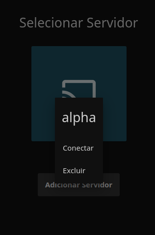
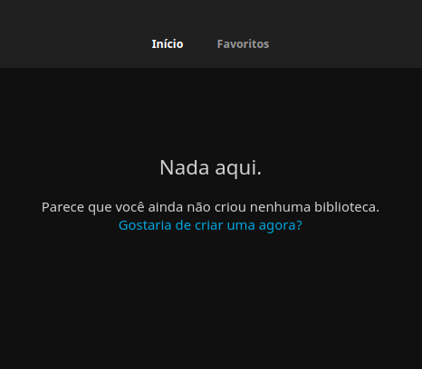

**VIDEOTECA SERVIDOR DE MÍDIA**

https://github.com/renanapcs

BASEADO EM CLOUD COMPUTER COM SERVIDORES VPS.

SISTEMA DEBIAN 11 GNU/LINUX.

HARDWARE VPS

**RAM: 2 GB Processador: 2 vCPUs HD/SSD:**  **60 GB**

FERRAMENTAS, HESTIACP(PHP, MARIADB, APACHE2, Nginx), RCLONE, DOCKER e JELLYFIN. CASAOS(opcional)

**ARMAZENAMENTO EM SERVIDOR CLOUD FORA DO SERVIDOR VPS.**


**Início.**

Preparando o sistema, vamos partir considerando que sua vps já tenha o sistema operacional instalado**.**

Precisamos de um gerenciador de Firewall fácil simples de configurar se você tem experiência com sistema GNU/LINUX OU UNIX consegue resolver isso rápido via terminal com ferramentas como UFW e IPTABLES. para facilitar e já ter uma gama de ferramentas e sistemas que iremos precisar logo mais, iremos partir para um CPanel. A escolha é pelo mais simples e de código aberto, seguindo o espírito UBUNTU, tudo que iremos usar neste projeto é de código livre e aberto.

A Partir daqui vamos considerar que já esteja logado via ssh e como root no seu servidor.

Instalando o hestiacp vamos seguir a documentação oficial do projeto hestia. https://hestiacp.com/docs/introduction/getting-started.html

Faremos o download do pacote.


```console
wget <https://raw.githubusercontent.com/hestiacp/hestiacp/release/install/hst-install.sh>
```


Vamos atualizar nosso repositório local com o comando  **apt  update** verificar as dependências de instalação com o comando **apt install ca-certificates**

```console
apt-get update && apt-get install ca-certificates
```

Agora com tudo ok, vamos fazer a instalação do hestiacp.

Execute o comando e aguarde o término da instalação preste atenção na mensagem no final da instalação nela você encontrará os dados para seu primeiro acesso ao painel de controle.

```console
bash hst-install.sh
```

CPanel instalado e você já tem o endereço de acesso seu ip ou dominio:8083 

seu login admin e sua senha.

Pra que serve esse cpanel? aqui está um pequeno resumo:

“HestiaCP é um painel de controle de hospedagem web gratuito e de código aberto, projetado para facilitar a administração de servidores Linux. Ele fornece uma interface gráfica amigável para gerenciar sites, contas de e-mail, bancos de dados, DNS e outras configurações do servidor.

Com o Hestia CP, os usuários podem criar e gerenciar sites, adicionar domínios, criar contas de e-mail, gerenciar bancos de dados, configurar backups automáticos e muito mais. Ele também oferece recursos de segurança, como proteção contra spam e malware. “

Agora que você já sabe o'que é o cPanel, vamos a configuração de firewall e dns do nosso servidor, antes vamos mapear as portas que iremos precisar para ter acesso a algumas aplicações do nosso site.

portas 

80 web http

443 web https

8096 servidor de mídia http

8920 servidor de mídia https

22 SSH provisório(altamente recomendado após o término de configuração do servidor fechar essa porta)

21 FTP provisório(altamente recomendado após o término de configuração do servidor fechar essa porta)

8083 Cpanel, provavelmente já está aberta.

**Recomendado para as portas 22, 21, 8083 restringir o acesso apenas aos ips do administrador do servidor.**


Faça seu login agora no Hestia cpanel. 

seu ip exemplo: 177.50.80.50:8083

Seu login provavelmente é **admin** essa informação estava na tela de instalação do hestia cp. sua senha **XYZ8049DFJNV**

Logado, procure pela engrenagem no canto superior direito.

depois clique em **Firewall** e **adicionar regra**


Na imagem abaixo adicionamos a porta 8096 para ficar acessível por qualquer ip na rede.


Clique em salvar, e repita o mesmo processo para as demais portas. 


Mais tarde voltaremos no cPanel para configurar nosso Domínio, subdomínios e servidor DNS e servidor de Email.


Agora que temos nosso Backend base, vamos partir para instalação do docker nesse projeto não utilizaremos o docker-compose, usaremos o docker puro.

A instalação é simples 
```console
apt update #para atualizar nosso sistema e dependência.
```

```console
apt install docker
```

faça login no docker 

```console
docker login
```
**login? docker ?** 

Calma, não se desespere! se você não sabe o que é o docker ou não tem um login no docker hub. Não se preocupe, aqui você vai aprender obásico para subir seu backend para suas aplicações web de forma simples e descomplicada. 

O'Que é docker ? 

Docker é uma plataforma de software que permite a criação, implantação e execução de aplicativos em contêineres. Contêineres são ambientes isolados que incluem tudo o que um aplicativo precisa para ser executado, como bibliotecas, dependências e arquivos de configuração.

O Docker torna a implantação e o gerenciamento de aplicativos mais rápidos e eficientes, permitindo que desenvolvedores e equipes de operações de TI criem e implantem aplicativos de maneira consistente e confiável em diferentes ambientes, desde laptops até servidores em nuvem.

Ao usar o Docker, os desenvolvedores podem empacotar suas aplicações em contêineres e distribuí-las facilmente, garantindo que esses aplicativos funcionem da mesma forma em diferentes sistemas operacionais e infraestruturas de nuvem.

Em resumo, o Docker é uma ferramenta poderosa para empacotar, distribuir e executar aplicativos em contêineres, o que ajuda a simplificar o processo de implantação e gerenciamento de aplicativos em diferentes ambientes.


Vamos usar o docker para subir um contêiner pronto do nosso servidor de mídia. usaremos a imagem oficial do jellyfin no docker hub.

se você não tem um login crie sua conta 

e faça login docker hub.

volte para o terminal e 

digite o comando.

```console
docker login
```
 se sua instalação ocorreu bem ele vai te pedir seu username. insira seu usuário que voce criou no docker hub. em seguida ele pedirá sua senha.  

Aguarde a mensagem  Login succeeded


Com o ambiente pronto faremos a instalação do jellyfin seguindo a documentação oficial 

<https://jellyfin.org/docs/general/installation/container>

Precisamos criar as pastas para os volumes do conteiner do Jellyfin. 

montaremos esses volumes em **/mnt/drive/jellyfin/**

```console
mkdir /mnt/drive/jellyfin/config

mkdir /mnt/drive/jellyfin/cache

mkdir /mnt/drive/jellyfin/Media
```

Agora podemos criar os volumes 

```console
docker volume create jellyfin-config

docker volume create jellyfin-cache

docker volume create jellyfin-Media
```


Se ao copiar e colar o comando você receberá uma mensagem de erro. 

Execute o comando **mkdir** em partes para criar as pastas uma por vez em sequência. 

Na imagem de exemplo das 2 primeiras pastas eu já tinha no meu servidor **/mnt/drive/** primeiro criei a pasta **jellyfin** na sequência as sub pastas **config**, **cache** e **Media.**


Ambiente preparado, vamos rodar o script para baixar e instalar o conteiner do jellyfin.

```console

docker run -d \

    -name jellyfin \

    --privileged \

    --net=host \

    --volume /mnt/drive/jellyfin/config:/config \

    --volume /mnt/drive/jellyfin/cache:/cache \

    --mount type=bind,source=/mnt/drive/jellyfin/Media,target=/Media \

    restart=unless-stopped \

    jellyfin/jellyfin

```

**Imagem do início do processo** 


Instalação Finalizada, rode o comando 
```console
docker ps
```


**Jellyfin** instalado e rodando. 

Para acessar o Jellyfin é simples, por padrão ele já vem configurado para sair pelas portas 8096 e 8920 http e https respectivamente. então basta ir para seu navegador e digitar seu ip:8096 ex: 177.50.80.50:8096 se voce estiver rodando no servidor local faça localhost:8096


A configuração do servidor de mídia no Jellyfin é simples e intuitiva, nessa primeira tela vamos apenas **excluir** esse servidor que parece por padrão, em seguida pressione F5 para atualizar a página, isso deve nos levar para wizard de instalação.




Configurando as bibliotecas.

Vou considerar que você já tenha passado pela tela de instalação e configurado seus dados de acesso e que já esteja na home. 

Na tela inicial, se você clicar em criar biblioteca, isso também é oferecido na tela de instalação, mas é preferível que você pule faça por aqui. 

Clique no texto em azul **Gostaria de criar uma agora?**


i


Agora você deve estar em Bibliotecas.

Clique em + configure o tipo de biblioteca e clique em pasta. 

Procure pela pasta Media e salve.


JellyFin configurado.


Agora que temos nosso servidor configurado e rodando falta o banco de mídias esse banco ou acervo pode esta local ou em outro servidor. aqui vamos fazer com um banco hospedado em outro servidor um provedor de storage separado do nosso ambiente. 

Como exemplo vamos utilizar o google drive, mas poderia ser qualquer um ou até + de um ou melhor a combinação de vários provedores de storage.  Assim separamos o ambiente de desenvolvimento do ambiente de curadoria e manuseio de arquivos dentro do nosso servidor evitando problemas de má manipulação e segurança. Concorda que o ambiente do Google Drive é mais amigável para gerenciar as pastas e arquivos comparado com um filezilla ou pelo próprio terminal? 

Para essa mágica acontecer usaremos o **Rclone**.

Aqui começa o capítulo **RCLONE SYNC.**

Como de costume vamos utilizar a documentação oficial do rclone.org e como sempre enfatizo que essa ferramenta é de código aberto e livre. se você não conhece essa poderosa ferramenta aqui vai um breve resumo.

“Rclone é um software de sincronização e gerenciamento de arquivos de código aberto, que permite aos usuários transferir e sincronizar arquivos entre diferentes locais de armazenamento na nuvem e sistemas de arquivos locais. O Rclone é compatível com vários provedores de armazenamento em nuvem, incluindo Amazon S3, Google Drive, Dropbox, Microsoft OneDrive, entre outros.

O Rclone foi criado por Nick Craig-Wood em 2014 e é escrito em linguagem de programação Go. Desde então, o Rclone tem sido constantemente atualizado e melhorado por uma comunidade ativa de desenvolvedores e usuários em todo o mundo.

O Rclone é útil para usuários que desejam fazer backup de seus arquivos para a nuvem, sincronizar arquivos entre diferentes provedores de armazenamento em nuvem ou gerenciar seus arquivos armazenados em nuvem e locais. Com sua interface de linha de comando, o Rclone pode ser facilmente integrado a scripts e processos automatizados, tornando-o uma ferramenta poderosa para gerenciamento de arquivos em larga escala.”


Instalando RCLONE

<https://rclone.org/drive/>

```console
sudo -v ; curl https://rclone.org/install.sh | sudo bash
```

após a instalação rode o comando

```console
rclone config
```


Na primeira tela ele pergunta o'que quer fazer? digite **‘n’** Novo Remoto.

```console
No remotes found, make a new one?

n) New remote

r) Rename remote

c) Copy remote

s) Set configuration password

q) Quit config

n/r/c/s/q> n
```

Em seguida ele pergunta o nome do nosso remoto(drive,cloud qualquer provedor que iremos configurar) de o nome que você quiser, nesse projeto chamaremos de **gdrive**.

**name> gdrive**

a próxima etapa é dizer qual provedor iremos usar. nosso é o google drive então digite drive

**Type of storage to configure.**

**Choose a number from below, or type in your own value**

**[snip]**

**XX / Google Drive**

`   `**\ "drive"**

**[snip]**

**Storage> drive**

A próxima tela é o tipo de autenticação por credenciais do Google Cloud. vamos pular e deixar em branco pressionando enter.

```console
Google Application Client Id - leave blank normally.

client\_id> enter

Google Application Client Secret - leave blank normally.

client\_secret> enter
```

Aqui vamos configurar o tipo de permissão que daremos as pastas e arquivos para o rclone. Nesse caso scop **1** acesso total 
```console
Scope that rclone should use when requesting access from drive.

**Choose a number from below, or type in your own value**

1 / Full access all files, excluding Application Data Folder.

  \ "drive"

2 / Read-only access to file metadata and file contents.

  \ "drive.readonly"

/ Access to files created by rclone only.

3 | These are visible in the drive website.

| File authorization is revoked when the user deauthorizes the app.**

   \ "drive.file"**

/ Allows read and write access to the Application Data folder.

4 | This is not visible in the drive website.

   \ "drive.appfolder"

/ Allows read-only access to file metadata but**

5 | does not allow any access to read or download file content.

  \ "drive.metadata.readonly"

scope> 1

```

Aqui é para passar as credenciais via arquivo json como exemplo estamos usando o google drive essas credenciais precisa ser solicitada no google cloud  assim como fizemos nas 2 primeiras perguntas, também deixaremos em branco pressionando enter.

```console
Service Account Credentials JSON file path - needed only if you want use SA instead of interactive login.**

service\_account\_file>
```
Agora vamos configurar o acesso a nosso google Drive via autenticação web. digite **y** em seguida enter.
```console
Remote config

Use web browser to automatically authenticate rclone with remote?

\* Say Y if the machine running rclone has a web browser you can use

\* Say N if running rclone on a (remote) machine without web browser access

If not sure try Y. If Y failed, try N.

y) Yes

n) No

y/n> y
```
Foi gerado um link para autenticação copie a url e cole no seu navegar, de preferência um que você já tenha sua conta google logada. de as permissões até aparecer a tela **Login sucesso!** essa etapa só vai funcionar para conexões locais. caso esteja fazendo em um servidor remoto você pode fazer uma conexão tunel ssh ou abrir uma vpn para seu servidor que dá no mesmo. mas configurar uma vpn é mais complicado.

installe o putty  e rode o sequinte comando alterando os dados para seu servidor remoto login e senha.

```console
apt install putty
sudo putty -ssh ipdoseuservidor -P 22 -l root -pw senhadoseuservidor -L 53682:127.0.0.1:53682

#exemplo: 

sudo putty -ssh 177.50.80.50 -P 22 -l joao -pw senhaforte -L 53682:127.0.0.1:53682
```
Caso seu login não seja root troque o root pelo seu login.

O Putty deve ser aberto aceite a conexão e as chaves. pronto abriu o terminal do putty. volte para o terminal que já esta aberto com o link de autenticação copie e cole no navegador o restante do processo é o mesmo já descrito acima.

```console
If your browser doesn't open automatically go to the following link: http://127.0.0.1:53682/auth

Log in and authorize rclone for access

Waiting for code...

Got code

Configure this as a Shared Drive (Team Drive)?

y) Yes

n) No

y/n> n

--------------------

[remote]

client\_id =

client\_secret =

scope = drive

root\_folder\_id =

service\_account\_file =

token = {"access\_token":"XXX","token\_type":"Bearer","refresh\_token":"XXX","expiry":"2014-03-16T13:57:58.955387075Z"}

--------------------

y) Yes this is OK

e) Edit this remote

d) Delete this remote

y/e/d> y

Pronto se você chegou até aqui seu drive já está configurado. 

para confirmar saia da tela do rclone config precione Ctrl + C


```


Agora execute o comando 
```console
rclone lsd gdrive:
```
Se tudo ocorreu bem ele deve listar os diretórios do seu google drive.


Agora precisamos montar essa unidade remota em uma pasta em nosso sistema.

Lembra da pasta que criamos para as mídias do jellyfin, agora vamos montar o gdrive nesta pasta. 


Montando GDRIVE
Priemro vamos habilitar permissão para os usuarios no modulo fuse.
```console
nano /etc/fuse.config
```
Apague o # da linha user_allow_other.

```console
# The file /etc/fuse.conf allows for the following parameters:
#
# user_allow_other - Using the allow_other mount option works fine as root, in
# order to have it work as user you need user_allow_other in /etc/fuse.conf as
# well. (This option allows users to use the allow_other option.) You need
# allow_other if you want users other than the owner to access a mounted fuse.
# This option must appear on a line by itself. There is no value, just the
# presence of the option.

user_allow_other


# mount_max = n - this option sets the maximum number of mounts.
# Currently (2014) it must be typed exactly as shown
# (with a single space before and after the equals sign).

#mount_max = 1000
```
Ctrl + O pra salvar e Ctrl + X pra sair.

Agora rode o comando para montagem da unidade.

```console
rclone mount --allow-non-empty -v gdrive:/mnt/drive/jellyfin/Media &
```

libere acesso a leitura e gravação na pasta para evitar problema com outros serviços como o jellyfin 

execute o comando 
```console
chmod -R 777 /mnt/drive/jellyfin/Media
```

Agora vamos conferir se a pasta foi montada e se nossos arquivos já estão disponíveis.

execute o comando **ls**
```console
ls -la /mnt/drive/jellyfin/Media
```

Se tudo ocorreu bem agora você está vendo seus documentos disponíveis na pasta Media.

Agora vamos garantir que a montagem sejá feita de forma automática caso precise reiniciar o servidor. usaremos o [crontab e] execute o comando:

```console
crontab -e
```
Se le te perguntar como abrir digite 1 para editar com "nano"
Adicione essa linha:

```console
@reboot sleep 240 && rclone mount --allow-non-empty gdrive: /mnt/drive/jellyfin/Media &
```


```console
# Edit this file to introduce tasks to be run by cron.
# 
# Each task to run has to be defined through a single line
# indicating with different fields when the task will be run
# and what command to run for the task
# 
# To define the time you can provide concrete values for
# minute (m), hour (h), day of month (dom), month (mon),
# and day of week (dow) or use '*' in these fields (for 'any').
# 
# Notice that tasks will be started based on the cron's system
# daemon's notion of time and timezones.
# 
# Output of the crontab jobs (including errors) is sent through
# email to the user the crontab file belongs to (unless redirected).
# 
# For example, you can run a backup of all your user accounts
# at 5 a.m every week with:
# 0 5 * * 1 tar -zcf /var/backups/home.tgz /home/
# 
# For more information see the manual pages of crontab(5) and cron(8)
# 
# m h  dom mon dow   command

@reboot sleep 240 && rclone mount --allow-non-empty gdrive: /mnt/drive/jellyfin/Media &

```

Esse comando automatiza a tarefa de montagem do nosso drive. o @reboot sleep 240 && 

Diz, após o inicialização aguarde 4 minutos representado por  240 segundos && então execute o comando rclone mount --allow-non-empty gdrive: /mnt/drive/jellyfin/Media & 

Esse tempo de espera é necessário para aguardar o sistema montar todo o sistema de diretório e iniciar os serviços necessários.


Ufa… agora temos um servidor, que deve funcionar perfeitamente com as mídias instaladas via cloud. 

Vamos dar um reboot no jellyfin execudando o comando:
```console
docker stop jellyfin
```

Em seguida:
```console
docker start jellyfin
```

Agora é só acessar o Jellyfin, ir para bibliotecas e clicar em **Rastrear todas as Bibliotecas.**

\---------------------------------------------------------------------------------------------------------------------------

Nosso backend esta pronto e em produção, precisamos ter um ambiente para trabalhar com nosso container sem estresse e de preferência fora do ambiente raiz do sistema. podemos fazer de diversas formas uma dela é configurar um servidor ssh  para nosso   conteine/rjellyfin  mas isso exige um pouco mais de experiência. Nossa dica bônus que escolhemos para fazer essa "gerência" dos conteiner é o CasaOS se você não conhece essa ferramenta poderosa segue o resumo. 

“A CasaOS é um projeto de código aberto construído pela comunidade que visa democratizar os dados e devolver o controle dos serviços aos usuários. A plataforma é voltada para oferecer uma experiência de nuvem doméstica simples em torno do ecossistema Docker, permitindo que criadores e desenvolvedores redefinam a experiência digital de nuvem privada e a levem a uma nova escala.

Um dos principais diferenciais da CasaOS é ser auto-soberano, ou seja, equilibrar os recursos da nuvem pública com o controle e a privacidade de uma infraestrutura totalmente local, oferecendo uma terceira opção para os usuários. Além disso, a plataforma é aberta e colaborativa, permitindo que o código-fonte seja compartilhado com a comunidade e que projetos inteligentes sejam criados com melhor colaboração entre os membros.

A CasaOS é fácil de usar, podendo ser implantada em qualquer máquina compatível com apenas uma única linha de código. A plataforma permite a personalização e gerenciamento da configuração via navegador da web ou cliente, tornando a experiência de uso ainda mais simples e acessível.”

Usaremos o casaOs apenas para gerenciar nosso conteiner  e se preciso gerenciar arquivos em nosso servidor via web. 

No Caso de implantação em rede local, você pode pular todos os capítulos e usar exclusivamente o casaOs só não faremos isso no nosso projeto pois estamos tratando uma camada de segurança o ideal seria fazer a gerência do contêiner de forma direta via ssh. 

Caso precise implantar mais alguma aplicação podemos fazer pelo casaOS de forma simples e rápida.


Instalando o CasaOS para gerenciar os contêineres e arquivos.

```console
curl -fsSL https://get.casaos.io | sudo bash
```

Aguarde o término da instalação, se tudo ocorrer bem, no final o casaOS informa o link de acesso.

por padrão o casaOs é instalado na porta 80 do servidor. Como já temos nosso servidor web rodando na porta 80 ele pula para próxima porta disponível no caso a 81 se seu domínio já estiver configurado você pode acessar seudiminio.com:81  uala seja feliz!

se não tiver o dominio.com pode acessar via o seu\_IP\_ Ex http://10.0.0.1:81

Pronto daqui pra frente é tão simples e intuitivo que nem precisa de comentário.


